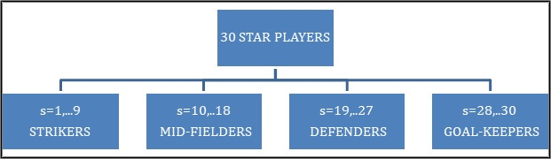
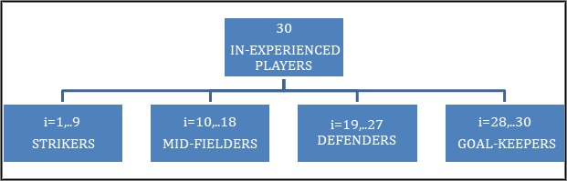
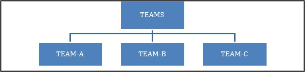
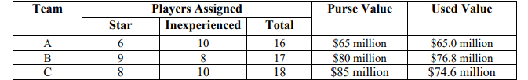
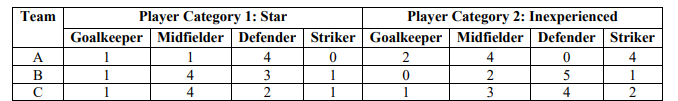
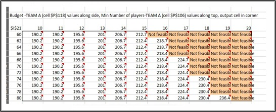

# Prescriptive-Analytics-Using-Integer-Linear-Programming
# DREAM TEAM SPORTS CONSULTANCY 

Soccer is the most popular game having a huge fanbase across the world. DREAMTEAM  SPORTS CONSULTANCY is a leading team strategy provider and is known for its team  building solutions in the field of soccer. For the upcoming season of Champions league, 3 teams  have together decided to seek assistance from Dream Team Sports Consultancy to build their teams  from a pool of 60 available players. 
Every team has a certain budget (not the same for all teams) wherein they need to build a team  consisting of 2 category players (star players and inexperienced players), a team manager and a  physio. Also, every team has certain requirements when it comes to the type of players.  
⇒ Mid-fielders 
⇒ Defenders 
⇒ Strikers 
⇒ Goalkeepers 
Each category players, managers and physios have a fixed price set to avail their duties. The franchise aims to build the team with minimal spending. 
This project strives to analyze and minimize the total allocation cost of the 3 teams.

# Integer Linear Programming (LP) Model 
Integer linear programming is a branch of linear programming where the only restriction is all the  variables of the model have to be only Integer. The divisibility requirement in this model is that  the non-integer solutions are not allowed. All the other requirements of objective function,  constraints, decision variables, non-negativity, Linear relationship and additivity remain constant.  
There are three types of integer models 
• Pure-integer model where all the decision variables are required to have integer values for the  optimal solution. 
• Zero-One integer model where the variables are restricted to either 0 or 1 (binary variables) • Mixed-integer model involves variables where some are integers, while others can be non integers i.e. binary. 
The algorithm that is used to solve the integer models is the branch and bound method. This method searches for an optimal solution by examining only a small part of the total number of possible solutions. This method starts with solving the model using the Simplex Method (similar to that of  the Linear programming method), in the process if the algorithm finds a non-integer solution, it breaks the area of the feasible solutions into sub problems until the optimal solution is found. If  the solution of a sub problem has a total profit or cost worse than the current feasible bound, it is  discarded, and only the remaining sub problems will be evaluated. At a point where no more  subproblems can be created i.e. all variables are integers the optimal solution is reached. This  model introduces the concept of feasible and infeasible bounds. 

#  Implementation Details 
The Problem statement for this project is to build three teams for a franchise considering the inputs  and requirements proposed by them while minimizing the total budget possible. In this process,  the team may or may not get a player, e.g. team gets a star striker or not, its either 0 or 1 but there  won’t be a situation where they get a fractional value of 1.5 player or a 0.75 player. To satisfy this  condition we chose Integer Linear Programming as this ensures that the above-mentioned situation  of getting decimal values doesn’t arise. 
# Formulation of the model 
The Team Allocation Model provides an optimal allocation of players, managers and physios to  the 3 teams. The main decision that the model needs to make is to allot different category players  of specific types to the 3 teams. These allocations are done in such a way that it minimizes the  total allocation cost to build the 3 teams. 
The Team Allocation Model is an integer linear program with binary values having a set of  constraints which are mainly the requirements placed by the 3 teams and the mandatory allocation  constraints. All these made the Model a large-scale application with 200 decision variables and  100 constraints hitting the maximum limit of the data solver.

The input for the model would be the three teams and the price tag for individual players. Each
category and type of players have a certain price tag for teams to obtain their services. The
allocation is done by meeting the objectives below:
• Minimize the overall allocation cost for the 3 teams.
• Build a team within certain budget proposed by the 3 teams.
• Satisfy the team combination requested by the 3 teams.
The optimized result shows the allocation of players to different teams as highlighted in the
spreadsheet, satisfying all the constraints and minimizing the total cost.

# Model Inputs
The initial step which goes in building the optimization model is to note down the inputs. In this
case the input is as shown:

# Results
After applying the linear programming model, all the constraints get thoroughly satisfied and the rest of the parameters for the 3 teams are explained as follows. 

# For Team A: 
From the 1st lot of 30 players, Team A has been allotted with one midfielder who happens to be the star player number 11. The team has been allotted with 4-star defenders with numbers 19, 20, 23 and 24 respectively and one-star goalkeeper at number 28. From the lot of 30 inexperienced players even though, Team A has not received any Star strikers, they have been assigned with 4 inexperienced strikers, which pretty much balances the team’s overall strength. Also, along with a bunch of star midfielders, the team has also been assigned with 4 inexperienced midfielders. Two inexperienced goalkeepers have also been assigned to Team A, which makes the total number of Goalkeepers to be 3. At the end with 4-star defenders, 4 inexperienced strikers, 5 midfielders (1 star & 4 inexperienced) and 3 Goalkeepers (1 Star and 2 Inexperienced) Team A has got a total of 16 players which was the team’s basic minimum requirement. Having said that the team has been assigned a good mix of both Star and In-experienced players with comparatively a lower budget of $65 million as compared to other two teams. Due to the added constraints and basic requirements given by the management, the budget is fully utilized, and the consultancy has provided the best optimized solution within the same. If this budget value is further increased, we might see more star players being assigned to Team A The team had a purse value of $ 65 million and the entire budget value has been used to fulfill their requirement.

# For Team B: 
From the spreadsheet, it is clearly seen that Team B’s purse value is slightly higher than that of Team A which is $ 80 million ($15 million more) and this gives them the scope of having a good mixture of Star and In-experienced players overall. Even if the budget is higher in this case, the team is also wanting to have 17 players (i.e. 1 extra player than team A). After optimizing, the team has been provided with 1-star striker, 4-star midfielders, 3-star defenders and 1-star Goalkeeper from the 1st lot of 30 Star players. If we look at the 2nd set of players, the team has been allotted with 1 In-experienced striker 2 In-experienced midfielders, and 5 In-experienced defenders. It is clearly seen that all the defenders allotted to the team are from 2nd set of Inexperienced players. Furthermore, we can conclude that, after having a comparatively higher budget their focus is on buying Star strikers than that of Star Defenders. Team B has been provided with 9 Star players and 8 In-experienced players, whereas for Team A which had a little lower budget had 6-star players and 10 In-experienced players. Even though the total purse value for Team B is $80 million, the utilized value is $76.8 which is $3.2 million less than the actual total. The team has done good progress in terms of meeting all the requirements yet settling up for lesser cost than the actual availability

# For Team C: 
The given purse value for this team was $85 million, which is $5 million more than Team B and $20 million more than Team A. However, Team C had a requirement of 18 players
in total, which is respectively more by 2 and 1 than Teams A & B. The team has been allotted with 1-star striker, 4-star midfielders, 2-star defenders and 1-star goalkeeper from the 1st lot of 30 players. There are 2 inexperienced strikers, 3 inexperienced midfielders, 4 inexperienced defenders and 1 inexperienced Goalkeepers allotted from the 2nd pool of players. Finally, we can see that there are total of 18 players being assigned, out of which 8 are Star players and 10 are inexperienced players, this allocation doesn’t completely suggest that more budget implies more star players and this trend was different for the 1st two teams. Out of the total given purse value of $85 million the budget utilized is $74.6, which is $10.6 million less than the availability. Team C has got all their requirements fulfilled in a much lesser value than what was given.

# Managers and Physios:
Team managers and support staff are an integral part of any team, along with the players the franchise also had the requirement of having one manager and physio each. Based on the budgets given by the respective teams, they have been allocated with respective managers and physios For 

# Team A: 
Team A has been allotted with Manager from category 2, whose value is $3.8 million, given the fact that Team A has less budget as compared to the other two teams and given the fact that the consultancy needs to accommodate both Players and support staff in a total of $65 million, hence M2 has been allotted to them which has the 2nd highest price for a manager. Physios were again divided into 3 different categories and Team A has been allocated with physio from category 1 with the least price i.e. $2.1 million. 

# Team B:
This team had the second highest budget which was $80 million. Out of the available lot of managers, this team has been allotted with the manager from the 3rd category which has the highest price of $4.2 million, the reason for this high value allocation for a manager could be the high purse value possessed by the team. A physio with a price of $2.2 million from category 2 was allocated to Team B. Given the scenario that the team has spent huge amount on Managers, hence it is feasible for them to get a Physio from category 2 to stay within the given budget.
# Team C:
Team C had the maximum total purse value of $85 million, they have been allotted with Manager from Category 1 with a price of $4 million which is the second highest price in the
category of managers. After utilizing moderate amount of money on a manager, the team has been allotted with a physio from Category 3 with the highest price of $2.3 million.

# Analysis
# 4.1 One-Way Analysis

The one-way analysis was carried out in order to understand if Team C could accommodate more number of inexperienced players which has been their approach since the beginning.
In the above one-way sensitivity analysis graph, by varying the number of minimum requirements of inexperienced players requested by Team-C, the effect on the minimized total cost can be deduced. The result shows that the optimal value stays at $218.4 million throughout, when the inexperienced players allotted to Team-C are varied from 1- 10. There is slight increase of $0.3 million in the optimal value when the 11th inexperienced player is allotted to Team-C. Beyond this point, any allotment of inexperienced players to Team-C is not possible.

# Two-Way Analysis

The above analysis provides the following insights:
A) To the management of Team A on how an increase in their budget (purse value) can result in increase in the total number of players being bought.
B) For the Dream Team Consultancy, how an increase in budget can vary their objective function which is the total minimum cost (sum of the three teams).
Team A has a budget of $65 million and they have used $64.9 million to get 16 players (which is their requirement). This analysis helps the team management to understand by how much should they increase their budget in order to increase the total number of players in their squad to 17 or 18 players. From the analysis we can see that for Team A to be able to buy a 17th player they have to increase their budget to $68 million from the current budget of $65 million (increase by $3 million). This increase in budget will increase the total minimum cost (objective function) from $218.4 million to 224.7 million, an increase by $6.3 million. With this budget it is not feasible to secure any other player as shown in the analysis. A further increase of budget by $2 million willdecrease the total minimum cost to $ 224.4 million, a decrease by $0.3 million but still they won’t be able to secure any new player (18th player) to their squad. The same is the case for a budget of $72 million, if the team management decides to get 18 players into their squad instead of 16 then they have to increase their budget to $ 74 million and this increase will have an effect on objective function (total minimum cost), taking it to $ 230.4 million (from initial 218.4 million), an increase of 12 million. With this budget of $ 74 million they will not be able to secure any additional player (more than 18) into their squad, same is the situation for a total budget of $76 million and $78 million as we can see from the report that it is not feasible. If the budget increases to $80 million then Team A will be able to get 19 players into their squad, this will increase the objective function (total minimum cost) to $236.4 million from $218.4, an increase by $18 million. With this budget of $80 million Team A won’t be able to secure any additional player to squad as we can see from the analysis that it is not feasible.

## Analysis 3

The above analysis provides the following insights:
A) To the management of Team B on how an increase in their budget (purse value) can influence the total number of players being assigned.
B) For the Dream Team Consultancy, how an increase in budget can vary their objective function which is the total minimum cost (sum of the three teams).
Team B has a budget of $80 million and they have used $76.8 million to get 17 players (which is their requirement). Now this report helps the team management to understand by how much should they increase their budget in order to increase the total number of players in their squad to 18 or 19 players. From the analysis we can see that for them to be able to buy a 18th player they have to increase their budget to $82 million from the current budget of $80 million (increase by $2million), this increase in budget will increase the total minimum cost (objective function) from $218.4 million to 224.4 million, an increase by $6 million. With this budget it is not feasible to buy any other player as shown in the report. A further increase of budget from $83 million to $ 85 million has no effect on the number of players being secured or on the objective function as we can see from the sensitivity analysis that it is not feasible. Here securing anymore players to the team is not feasible and the objective function (minimum total cost) remains insensitive for any further change in the total budget.
